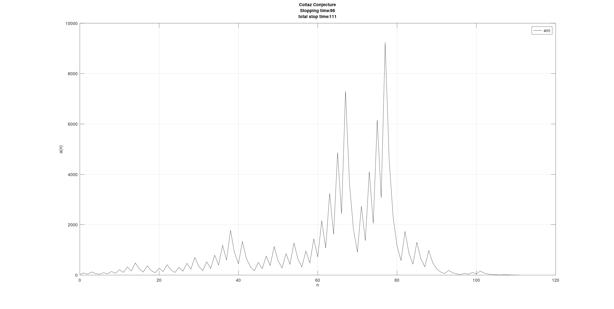
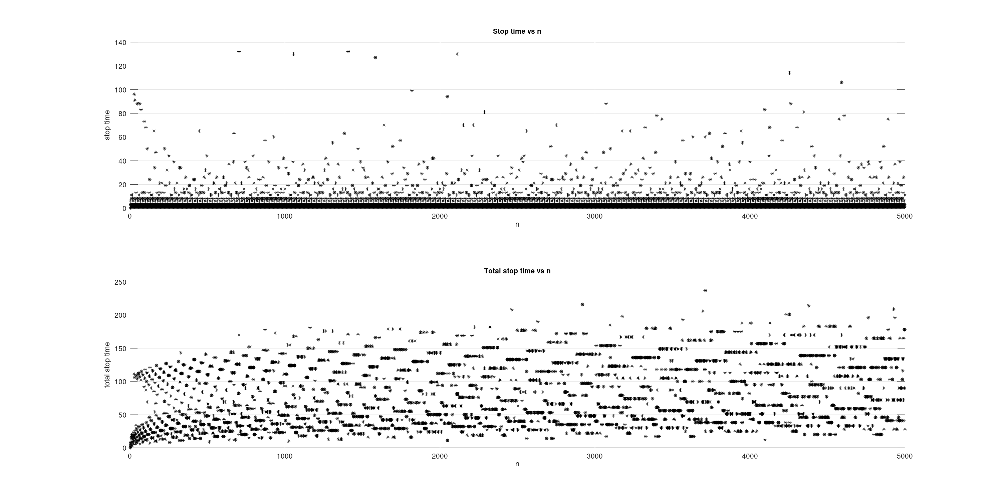

# collatz

A program to test the collatz conjecture[^1] in ocatve. This script computes various data related
to the collatz conjecture, presenting them is suitable graphs

## How to Use

To use the script you have to set some variables in the main file *[test_seq.m](test_seq.m)*. Primarily
the `num` variable. (Don't forget the semi-colen at the end of a line `:)`).

```matlab
num = 500;
```

There are three other variables that control the behaviour of the program. The first one is `single_run_flag`:

```matlab
single_run_flag = 0;
```

When you set this value to 0, the program runs for every collatz series between `1` to `num`. We can contol the
plot with `plot_collatz_data`.


```matlab
plot_collatz_data = 0;
```

When this is set to zero, only the stop time data is plotted. Otherwise when this is set to 1, every series
between `1` and `num` is plotted in a seperate plot window.

When we set `single_run_flag = 1`  only one iteration of the collatz series is performed, and the series data is plotted.

## Examples

`single_run_flag = 1`, for `num = 27;` :



`single_run_flag = 0` (with `plot_collatz_data = 0`), for `num = 5000;` :




[^1] [Collatz Conjecture](https://en.wikipedia.org/wiki/Collatz_conjecture#Statement_of_the_problem)
